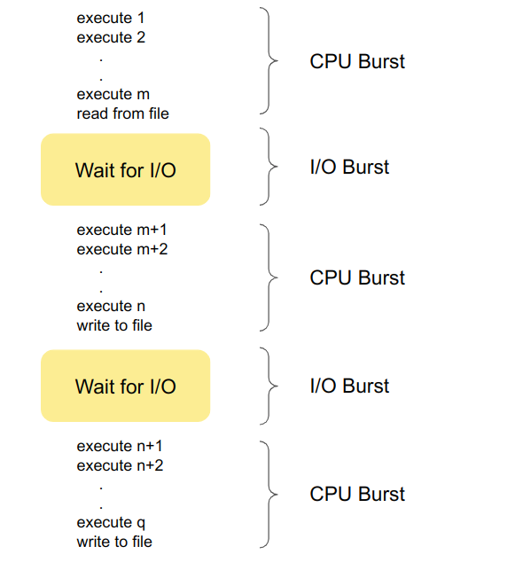
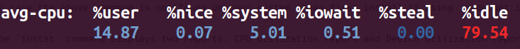
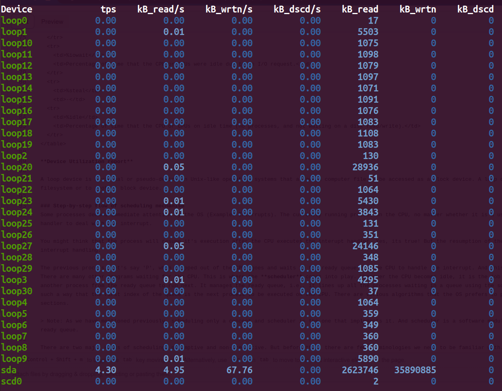

# Scheduling in OS
## Introduction 

By now you must have already realized that an Operating system (OS) is not a monolithic system and rather a complex and meticulous synchronization of various subsystems (Process Management subsytem, Memory management subsytem, I/O management subsystem etc..) that provide services to the user and applications. In the previous [Context Switching](https://virtual-labs.github.io/exp-context-switching-iiith/theory.html) experiment we have already seen Process Management sussystem, Error handling subsystem and I/O management subsystem working together to make a successful context switch between two processes.

Similar to that of context switching, the mechanism of **scheduling** is also a part of 'Process Management Subsystem'. However, while context switching is responsible to **store, restore and load** the new context on the Central Processing Unit (CPU), scheduling is responsible for **selecting** or handing the over the next process ready to be executed on the CPU. We will discuss more about this in the following sections.

## Scheduling and Scheduler

Before diving into the topic of scheduling, let us first clearly understand what scheduling and scheduler means. 

**Scheduling** is the overall concept and process of determining the order in which processes or tasks are executed on the CPU. It encompasses the strategies and algorithms used to make decisions about when and for how long each process runs on the CPU. It ensures fairness, optimizing resource utilization, and achieving specific system performance goals.

**Scheduler** is the actual *software entity* responsible for executing the software policies defined by the OS. The scheduler code is implemented as a part of the kernel code.

> Note: The objective of this experiment is to understand process of scheduling and we won't go into in-depth analysis of the scheduling algorithms used by the operating systems.

-----------------

### The scheduler performs the following tasks:

* **Selecting Processes:** It decides which process from the pool of ready processes should be granted access to the CPU. The specific scheduling algorithm used determines the selection criteria.

* **Enforcing Priorities:** If priority-based scheduling is in use, the scheduler ensures that higher-priority processes are given precedence over lower-priority ones.

* **Allocating CPU Time:** The scheduler determines how much CPU time each process is allowed to use. In a preemptive scheduling system, it can interrupt the currently running process to allocate CPU time to a higher-priority process.

* **Managing the Ready Queue:** It maintains a ready queue or a list of processes that are in a state to execute and selects processes from this queue for execution.

> **Note:** Context switching is not a subpart of scheduling or a job done by the scheduler. It is an independent mechanism which aids the OS to implement the decision (which process to run next) made by the scheduler.

## Why do we need scheduling?

We now have a basic understanding of what a scheduler is. But why is it important in process management? 

Almost all programs have some alternating cycle of CPU usage and waiting for I/O of some kind.
In a simple system running a single process, the time spent waiting for I/O is wasted, and those CPU cycles are lost forever. A scheduling system allows one process to use the CPU while another is waiting for I/O, thereby making full use of otherwise lost CPU cycles.

**CPU-I/O Burst Cycle**

Almost all processes alternate between two important time periods in a continuing cycle:
* A CPU burst (running state) of performing calculations, and
* An I/O burst (waiting state), waiting for data transfer in or out of the system.

There is also a ready state where the process is ready to use the CPU resources but let us just look at how the process execution flow looks like if no other process is allowed to compete for the CPU resources before the current process executes till it's completion. Below figure shows a simple alternating CPU and I/O burst cycle.



Process with more I/O bursts are called I/O bound, whereas processes with higher computation and need more CPU resources are termed as CPU bound. 

In general, most of the applications we use are I/O bound. Which means that the CPU is idle for most of it's time. Instead of making CPU wait for the I/O request to be fulfilled, it would be more efficient if we use these clock cycles for other waiting processes. Scheduling does a pretty good job in utilising the CPU cycles efficiently. There are few other methods like caching, and parallelization to reduce the wastage of clock cycles and decrease the I/O wait time but scheduling mechanism is the one that helps the CPU cycles to be utilized more efficiently.

### Resources

[CPU bound and I/O bound - Wikipedia](https://en.wikipedia.org/wiki/I/O_bound)

[CPU and I/O burst cycles - Baeldung](https://www.baeldung.com/cs/cpu-io-burst-cycles)

------------

## Types of scheduling

**Non-preemptive scheduling:** The simplest case of process execution is where the processes run till completion. Then the scheduler runs on the CPU and chooses the earliest arriving process. This is basically the **first-come-first-serve (FCFS)** idea. In this kind of process, there is no chance that any arrival of a new process can halt the current process's execution and replace it. Every new incoming process has to wait in the ready queue before the scheduler finally permits it to use the CPU. This kind of scheduling is called non-preemptive scheduling. No matter how many I/O bursts the process has, the scheduler will not give the CPU a new process till the current one terminates. Few other examples of non-preemptive scheduling are Shortest-job first(SJF) and Priority scheduling.

-------------

**Preemptive scheduling:** Preemptive cpu scheduling algorithms may take the cpu away from a running process BEFORE it has finished it's burst time. In this kind of scheduling every process is given a **burst time** by the scheduler. The burst time is the amount of time the scheduler thinks would be enough to execute the process till the end. Note that the burst time of a process would only be known to the scheduler after the process completes it's entire execution. Till then, it only calculates the burst time based on the prior information of the execution times of the previous processes.

### Resources

[Process scheduling - Who goes to run next](https://people.cs.rutgers.edu/~pxk/416/notes/07-scheduling.html)

[CPU scheduling - Finding the Burst time - Stack overflow](https://stackoverflow.com/questions/24848864/cpu-scheduling-finding-burst-time#:~:text=in%20general%20scheduler%20estimates%20the,CPU%20bursts%20for%20that%20process%20.)

-------------

## Transitional state view of scheduling

Let us look at how the system state changes as the execution of processes starts on the CPU.

Let us represent each state as 

$$
X_{s} = 
\begin{cases}
\text{readyQ:} \overrightarrow{id} & \quad \text{A vectore representing all the processes in the ready queue.}\\ 
\text{cpu: current pid} & \quad \text{current pid represents the current process running on the CPU.}\\
\text{Ptime Map:} \overrightarrow{id} \rightarrow \overrightarrow{executedTime}:\overrightarrow{TotalExecutionTime} & \quad \text{Maps each process to the time they have spent on the CPU and the total time they need to complete their execution}\\
\text{timer: T} & \quad \text{The amount of time after which the CPU is prompted to take a new process}
\end{cases}
$$

Let us have a deeper look at this CPU-I/O burst cycles. Use the below command and run it on your linux machine to get a deeper view of how processes utilize I/O systems and CPU.
```
iostat
```
In case the above command is not found on your system, then first install it using `sudo apt install sysstat` and then run the above command again.

The `iostat` command displays two reports. CPU utilization report and Device utilization report.

**CPU Utilization Report**

For multiprocessor systems, the CPU values are global averages among all processors. Below is a CPU utilization report generated on a linux machine.



What does the above report indicate?

<table>
  <tr>
    <td>%user</td>
    <td>Percentage of CPU utilization while executing at user level.</td>
  </tr>
  <tr>
    <td>%nice</td>
    <td>Percentage of CPU utilization while executing at user level with nice priority.</td>
  <tr>
    <td>%system</td>
    <td>Percentage of CPU utilization while executing at kernel level.</td>
  </tr>
  <tr>
    <td>%iowait</td>
    <td>Percentage of time that the CPU or CPUs were idle due to an I/O request.</td>
  </tr>
  <tr>
    <td>%steal</td>
    <td>-</td>
  <tr>
    <td>%idle</td>
    <td>Percentage of time that the CPU or CPUs on idle time (no processes, and not waiting on a disk read/write).</td>
  </tr>
</table>

**Device Utilization report**



A **loop device** is a virtual or pseudo-device in Unix-like operating systems that allows a computer file to be accessed as a block device. A loop device maps its data blocks to the blocks of a regular file in a filesystem or to another block device.

<table>
  <tr>
    <td>Device</td>
    <td>This column gives the device (or partition) name as listed in the `/dev` directory.</td>
  </tr>
  <tr>
    <td>tps</td>
    <td>It indicate the number of transfers per second that were issued to the device. A transfer is an I/O request to the device.</td>
  </tr>
  <tr>
    <td>kB_read/s</td>
    <td>Indicate the amount of data read from the device expressed in a number of kilobytes per second.</td>
  </tr>
  <tr>
    <td>kB_wrtn/s</td>
    <td>Indicate the amount of data written to the device expressed in a number of kilobytes per second.</td>
  </tr>
  <tr>
    <td>kB_dscd/s</td>
    <td>Indicate the amount of data discarded for the device expressed in a number of kilobytes per second.</td>
  </tr>
  <tr>
    <td>kB_read</td>
    <td>The total number of kilobytes read.</td>
  </tr>
  <tr>
    <td>kB_wrtn</td>
    <td>The total number of kilobytes written.</td>
  </tr>
  <tr>
    <td>kB_dscd</td>
    <td>The total number of kilobytes discarded.</td>
  </tr>
  
</table>

### Step-by-step flow of scheduling mechanism
Some processes demand immediate attention by the OS (Example: Interrupts). The currently running process on the CPU, no matter whether it is a user process or a kernel process, will be replaced by the interrupt handler to deal with the interrupt. 

You might think that the process will resume it's execution after the CPU executes the interupt handler. Yes, its true! But the resumption of the process execution doesn't necessarily happen immediately after interrupt handling. 

The previous process, let's say 'P', when swapped out of the CPU, goes and waits in the ready queue for the CPU to handle the interrupt. And this ready queue doesn't contain only one process 'P' waiting in it. There are many other programs waiting for the CPU. This is where the **scheduler** comes into play. Whenever the CPU becomes idle, it is the job of the CPU Scheduler ( a.k.a. the short-term scheduler ) to select another process from the ready queue to run next. It manages the ready queue, i.e., it lines up all the processes waiting in a queue using the scheduling algorithm defined by the OS and rearranges the queue in such a way that the first index of the queue is the next process to be executed on the CPU. There are various algorithms that the OS prefers to prioritize one process over another. They will be discussed in later sections.

> Note: As we have mentioned previously, scheduling only a concept and scheduler is the one that implements it. And scheduler is a software module and it has to run on the CPU to schedule the processes in the ready queue.

There are two major kinds of scheduling, preemptive and non-preemptive. But before that, there are few terminologies we need to be familiar with.
Almost all programs have some alternating cycle of CPU number crunching and waiting for I/O of some kind. ( Even a simple fetch from memory takes a long time relative to CPU speeds. )
In a simple system running a single process, the time spent waiting for I/O is wasted, and those CPU cycles are lost forever.
